# 🐧 Linux – Real-Time DevOps Automation Project

This project demonstrates a **complete Linux server automation workflow** used in real-world DevOps environments.  
It covers **user management, permissions, automation, monitoring, security hardening, LVM storage, firewall configuration, and custom system services**.

---

# 📘 Level 1 – Basic (Foundational Skills)

### 🎯 Objective  
Prepare the Linux environment for application deployment.

---

## ✅ User & Group Management

### Commands
```bash
# Create group
sudo groupadd devteam

# Create users and add to group
sudo useradd -m -G devteam devuser1
sudo useradd -m -G devteam devuser2

# Set passwords
sudo passwd devuser1
sudo passwd devuser2
````
📸 Evidence


## ✅ Permission Management

### Commands

```bash
# Create project directory
sudo mkdir -p /opt/myproject

# Assign group ownership
sudo chown -R :devteam /opt/myproject

# Grant read/write/execute permission to group
sudo chmod -R 775 /opt/myproject

# Verify permissions
ls -ld /opt/myproject
```

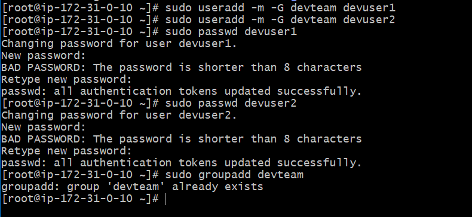

## ✅ Package Installation

### Commands

```bash
# Update repositories
sudo apt update          # Ubuntu/Debian
sudo yum update -y       # RHEL/CentOS/Amazon Linux

# Install Git
sudo apt install git -y
sudo yum install git -y

# Install Nginx
sudo apt install nginx -y
sudo yum install nginx -y

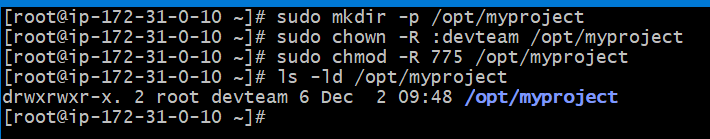

# Install Java
sudo apt install openjdk-11-jdk -y
sudo yum install java-11 -y
```
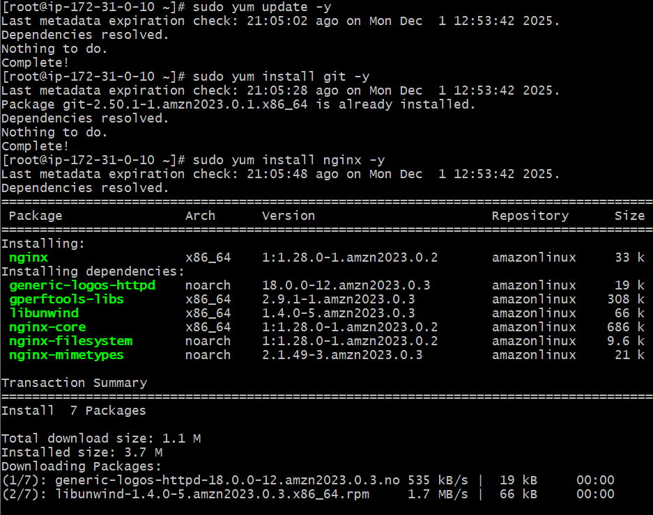
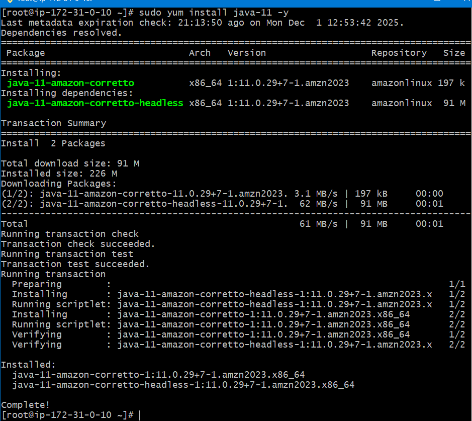

---

## ✅ System Information Checks

### Commands

```bash
# CPU information
lscpu

# Memory usage
free -h

# Disk usage
df -h

# Running processes
top
ps aux
```

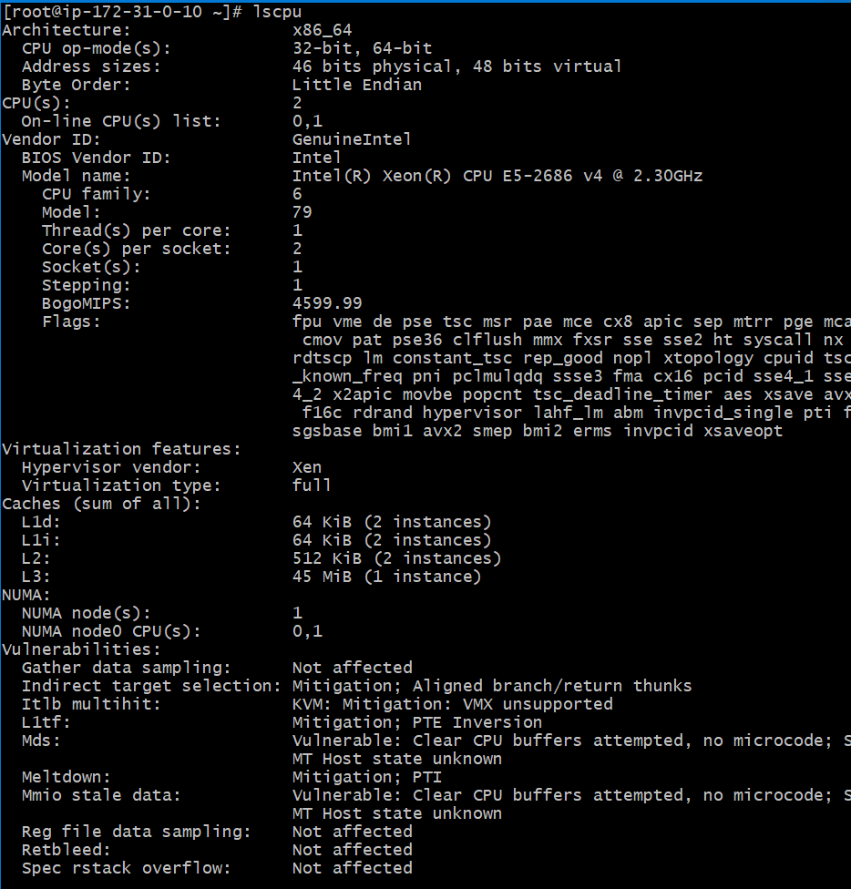


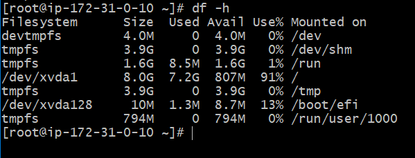

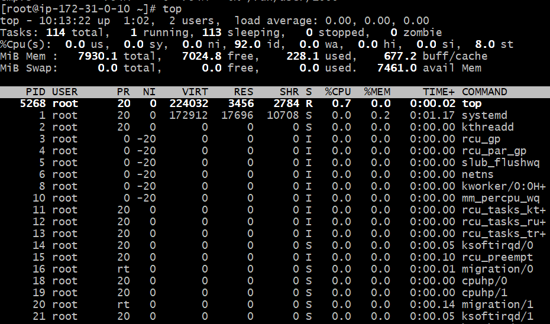

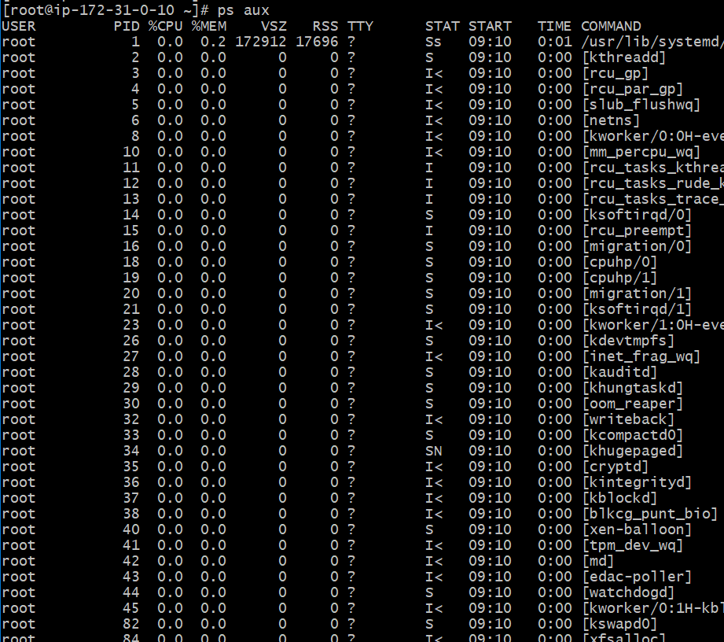

---

# 📙 Level 2 – Intermediate (Daily DevOps Tasks)

### 🎯 Objective

Automate routine tasks and maintain server health.

---

## ✅ Automated Backup with Cron

### Commands

```bash
crontab -e
```

```bash
# Backup project daily at 1 AM
0 1 * * * tar -czf /opt/backup/project-$(date +\%F).tar.gz /opt/myproject
```
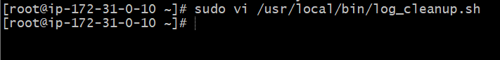


---

## ✅ Shell Scripting (Automation)

### Log Cleanup Script

```bash
sudo vi /usr/local/bin/log_cleanup.sh
```

```bash
#!/bin/bash
find /var/log/myapp -type f -mtime +7 -delete
```

```bash
sudo chmod +x /usr/local/bin/log_cleanup.sh
```

📸 Evidence

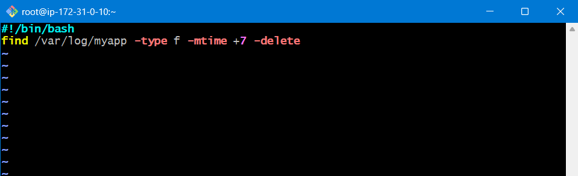

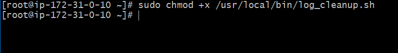
---

### Service Restart Script

```bash
sudo vi /usr/local/bin/restart_service.sh
```

```bash
#!/bin/bash
systemctl restart nginx
```


---

### Health Check Script

```bash
sudo vi /usr/local/bin/health_check.sh
```

```bash
#!/bin/bash
echo "CPU Usage:"
top -bn1 | grep "Cpu(s)"
echo "Memory Usage:"
free -h
echo "Disk Usage:"
df -h
```


---

## ✅ Log Management

### Commands

```bash
cd /var/log

# View system logs
tail -f syslog      # Ubuntu
tail -f messages    # RHEL

# Search for errors
grep -i error /var/log/syslog
```


---

## ✅ System Performance Monitoring

### Commands

```bash
top
htop
vmstat 5
iostat
journalctl -u nginx
systemctl status nginx
```


---

# 📕 Level 3 – Advanced (Production-Ready Linux Admin)

---

## ✅ Custom systemd Service

### Commands

```bash
sudo nano /etc/systemd/system/myapp.service
```

```ini
[Unit]
Description=My Application Service
After=network.target

[Service]
User=devuser1
ExecStart=/usr/bin/java -jar /opt/myapp/app.jar
Restart=always

[Install]
WantedBy=multi-user.target
```


```bash
sudo systemctl daemon-reload
sudo systemctl enable --now myapp
```


---

## ✅ SSH Hardening

### Commands

```bash
sudo nano /etc/ssh/sshd_config
```

Apply:

```text
PermitRootLogin no
PasswordAuthentication no
Port 2222
```


```bash
sudo systemctl restart sshd
```


---

---

## ✅ Firewall Configuration

### firewalld

```bash
sudo firewall-cmd --add-service=http --permanent
sudo firewall-cmd --add-service=https --permanent
sudo firewall-cmd --reload
```


---

### iptables

```bash
sudo iptables -A INPUT -p tcp --dport 80 -j ACCEPT
sudo iptables -A INPUT -p tcp --dport 443 -j ACCEPT
sudo service iptables save
```


---

## ✅ Log Rotation

### Commands

```bash
sudo nano /etc/logrotate.d/myapp
```

```conf
/var/log/myapp/*.log {
    daily
    rotate 10
    compress
    missingok
    notifempty
    create 0640 root root
}
```


```bash
sudo logrotate -d /etc/logrotate.d/myapp
```


---

# 🏁 Project Outcome

This project demonstrates **real-world DevOps Linux administration skills**:

✅ Linux system setup
✅ User & permission management
✅ Automation using cron & shell scripts
✅ Monitoring & troubleshooting
✅ Security hardening (SSH & firewall)
✅ Custom system services
✅ Production-ready server configuration

---


